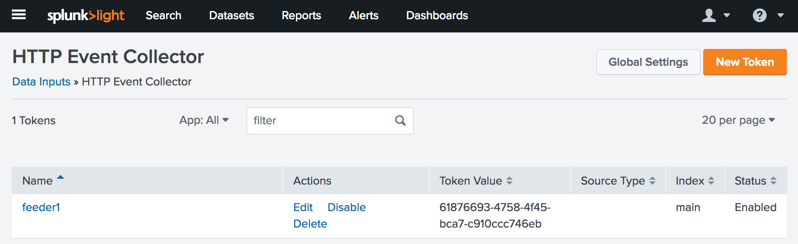
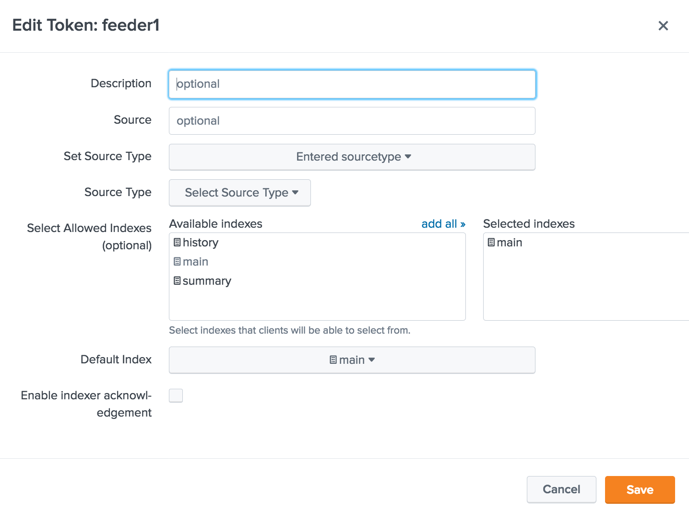
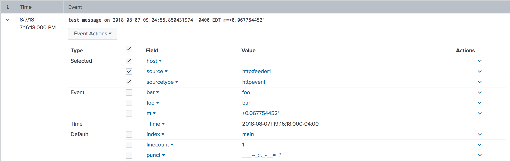

[](https://goreportcard.com/report/github.com/greenpau/gosplunk) [](https://travis-ci.org/greenpau/gosplunk) [](https://github.com/greenpau/gosplunk)

# Golang Client Libraries for Splunk

## HTTP Event Collector Client Library

Splunk's HTTP Event Collector (HEC) is an endpoint allowing sending messages
to Splunk via RESTful API using HTTP/S transport. The endpoint identifies
its clients based on a token the clients' provide. A Splunk administrator
configures tokens under "Add Data", "HTTP Event Collector". Once configured,
the administrator provides the token to a client application.

By default, the HTTP Event Collector receives data over HTTPS on TCP port 8088.

If necessary, enable HEC tokens by running the following command on the server:

```bash
curl -k -X "POST" -u admin:password https://localhost:8089/servicesNS/admin/splunk_httpinput/data/inputs/http/http/enable
```

### Getting Started

If necessary, create HEC token:



The "Input Settings" for the HEC are:
* Source Type: Automatic
* App context: Search & Reporting
* Index: `main`



Prior to connecting to HEC, check its availability:

```bash
echo -n | openssl s_client -showcerts -connect splunk:8088
```

The expected result would look like this:

```
CONNECTED(00000003)
depth=1 C = US, ST = CA, L = San Francisco, O = Splunk, CN = SplunkCommonCA, emailAddress = support@splunk.com
verify error:num=19:self signed certificate in certificate chain
---
Certificate chain
 0 s:/CN=SplunkServerDefaultCert/O=SplunkUser
    i:/C=US/ST=CA/L=San Francisco/O=Splunk/CN=SplunkCommonCA/emailAddress=support@splunk.com
```

Next, create a configuration file at `~/.splunk.hec.yaml` with the following contents:

```yaml
---
collector:
  host: 'splunk'
  port: 8088
  token: '61876693-4758-4f45-bca7-c910ccc746eb'
```

Then, compile and run this :

```bash
make
bin/http-event-collector-client
```

The expected output follows. Here, the client sends a message, plus two
event fields: `foo` and `bar`:

```bash
$ bin/http-event-collector-client
DEBU[0000] splunk-http-collector-client: proto=https
DEBU[0000] splunk-http-collector-client: host=splunk
DEBU[0000] splunk-http-collector-client: port=8088
DEBU[0000] splunk-http-collector-client: token=61876693-4758-4f45-bca7-c910ccc746eb
DEBU[0000] splunk-http-collector-client: timeout=5
DEBU[0000] splunk-http-collector-client: endpoint.health=https://splunk:8088/services/collector/health
DEBU[0000] splunk-http-collector-client: endpoint.event=https://splunk:8088/services/collector/event
DEBU[0000] splunk-http-collector-client: endpoint.raw=https://splunk:8088/services/collector/raw
DEBU[0000] splunk-http-collector-client: url=https://splunk:8088/services/collector/health
DEBU[0000] splunk-http-collector-client: status=200 OK
DEBU[0000] splunk-http-collector-client: HEC is available and accepting input
DEBU[0000] splunk-http-collector-client: code=17, text=HEC is healthy
DEBU[0000] message="{ test message on 2018-08-07 09:42:03.651128622 -0400 EDT m=+0.067162200" map[foo:bar bar:foo]     0}"
DEBU[0000] splunk-http-collector-client: url=https://splunk:8088/services/collector/event
DEBU[0000] splunk-http-collector-client: status=200 OK
DEBU[0000] splunk-http-collector-client: code=0, text=Success
```

Once successful, the Splunk would have the following indexed event:




### References
* [HTTP Event Collector REST API endpoints](http://docs.splunk.com/Documentation/Splunk/7.1.2/Data/HECRESTendpoints)
* [HTTP Event Collector Examples](http://docs.splunk.com/Documentation/Splunk/7.1.2/Data/HECExamples)
* [HTTP Event Collector REST API Endpoints](http://docs.splunk.com/Documentation/Splunk/7.1.2/RESTREF/RESTinput#services.2Fcollector):
  * [services/collector/health](http://docs.splunk.com/Documentation/Splunk/7.1.2/RESTREF/RESTinput#services.2Fcollector.2Fhealth)
  * [services/collector/event](http://docs.splunk.com/Documentation/Splunk/7.1.2/RESTREF/RESTinput#services.2Fcollector.2Fevent)
